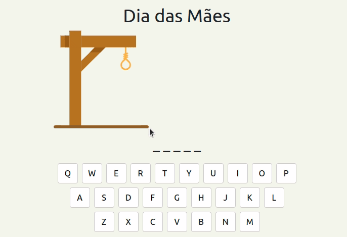

# O desafio da forca

Este repositório contem a minha resolução para o desafio do StartDB: desenvolver as regras de um jogo da forca. 😎😎

O jogo da forca antigamente necessitava de duas pessoas, uma para selecionar a palavra secreta e outra para tentar acertar. A pessoa que escolhia a palavra desenhava/registrava tudo no papel, desde o desenho da forca, as letras acertadas e letras erradas. Algo muito próximo do gif abaixo.

 

> **Observação:** Foram implementadas apenas as regras do jogo, não foi desenvolvido a interface do jogo, o GIF é para demonstração.

## Instalando o Node e rodando localmente

1. Instalar o [Node](https://nodejs.org/en/)
2. Instalar dependencias do projeto com o seguinte comando:
```bash
npm install
```

## Regras do jogo

As regras estão descritas [nesse arquivo](docs/Regras.md).

Vamos C.R.E.S.C.E.R juntos?! 🚀🚀